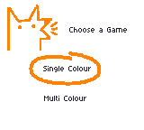
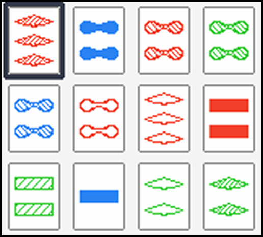

# Packs Retro Port
Available at [retro.packsgame.com](https://retro.packsgame.com/).

A port of [Packs, the pattern matching card game](https://packsgame.com) originally released in 2018 for android, iOS, and web.

[Created using CrossZGB](https://github.com/gbdk-2020/CrossZGB).

Designed to run on Gameboy Color and Pocket.

## CI
[The build workflow](./.github/workflows/build-and-package.yml) runs every push to the main branch, and uploads the rom file as an asset.

## Custom Boot Logo
The Nintendo™️ logo is replaced with a custom boot logo:

This is done using [the @joshbalfour/gb-custom-logo npm module](https://www.npmjs.com/package/@joshbalfour/gb-custom-logo).

## Game logic
[Game logic lives in packs.c](./src/packs.c), and [rendering logic lives in the Game State](./src/StateGame.c). Huge thanks to [sanderevers](https://github.com/sanderevers) for [their blog post expressing SET cards as binary](https://sanderevers.github.io/2019/09/11/finding-sets.html), which I borrowed from heavily.

## Debugging
Once your IDE is set up following the CrossZGB tutorial, you can step through and debug that way, but I also found [GBDK emu_debug](https://gbdk.org/docs/api/gbdk_2emu__debug_8h.html) useful to log to the Emulicious console. [Larold's Retro Gameyard has a great tutorial on this](https://laroldsretrogameyard.com/tutorials/gb/debugging-your-gbdk-2020-game/).

## Physical Release Materials
* Cart: insideGadgets, 14 usd + tax + shipping + 7 usd for custom boot logo
* Shell: insideGadgets, 3.5 usd + tax + shipping
* Case: https://retrosix.co.uk/Universal-Game-Cases-Game-Boy-Color-Advance-p158344576, 5.75 gbp
* Self print:
    * cart sticker (sticker paper + cut)
        * https://retro.packsgame.com/Sticker.pdf 
    * case cover (thin A4 photo paper)
        * https://retro.packsgame.com/box.pdf 
    * manual (based on https://soully.itch.io/game-boy-instruction-manual-figma-template)
        * https://retro.packsgame.com/instructions/Complete_Manual.pdf 
